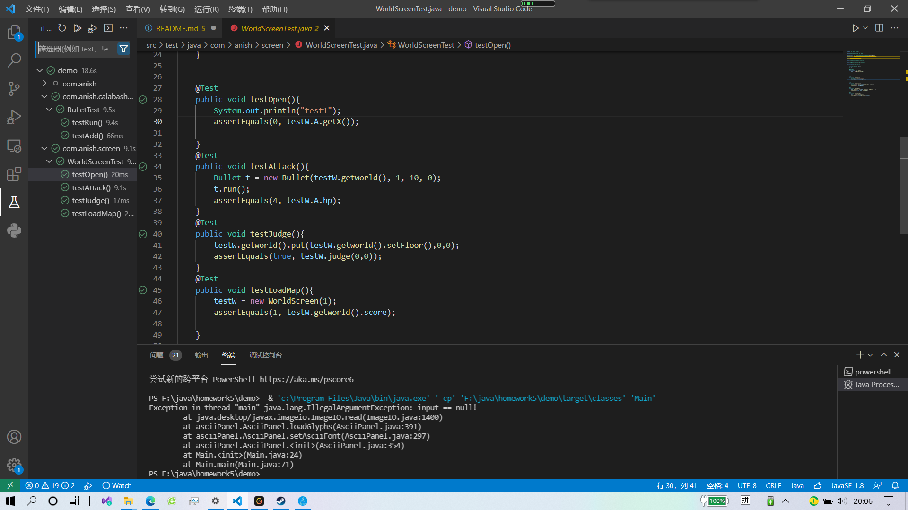

# jw05单元测试部分

使用了maven自动构建，以及vsc的coverage gutter查看覆盖度情况

-主要对自己改动较大的worldscreen类，bullet类等的方法进行了测试，测试过程当然也牵扯了world和敌人等类

这几个测试样例主要测试的是

    1.testRun子弹能否按规定方向正常飞行到边界
    2.testOpen能否正确创建默认地图并放置玩家在默认位置
    3.testAttack子弹等否按照方向正常飞行并在击中玩家时扣血
    4.testEnemy子弹能否按照方向正常飞行并在击中敌人时扣血
    5.testJudge判断一个tile是否可以前进的方法的正确性
    6.testLoadMap加载地图能否正确读取信息

剩下的很多代码牵扯到keyEvent，我上网查了很久也没有查到在测试过程中模拟键盘输入的方法，于是只能作罢。还有想测试线程在run的过程中行为是否正常也没找到方法，非常可惜

最后上传时因为文件太多运行了一次mvn clean
